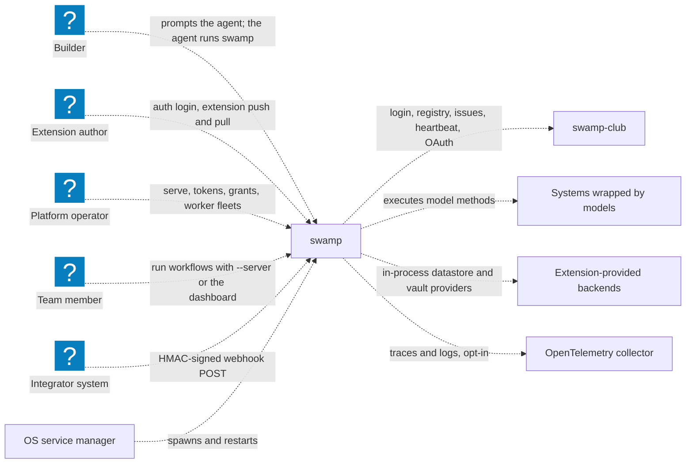
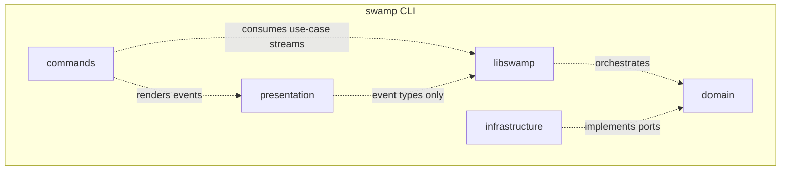
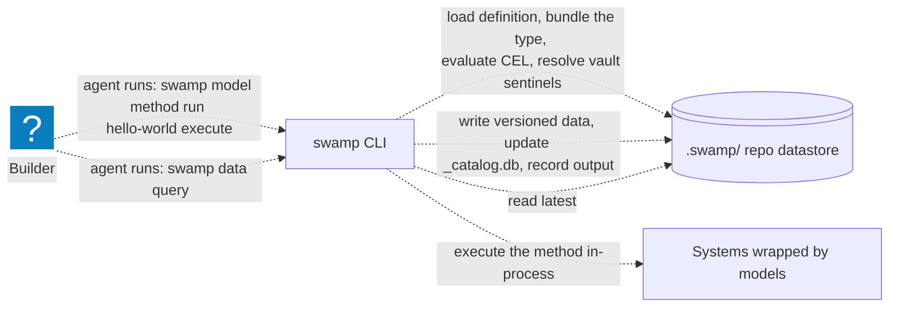
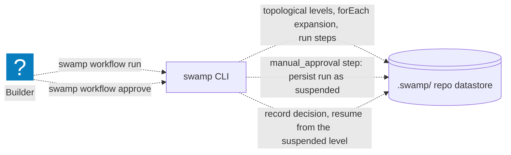
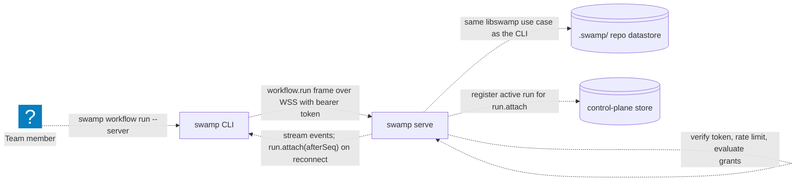
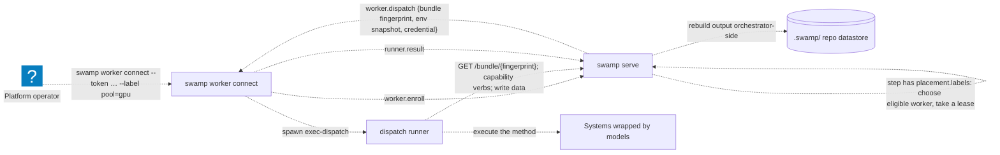
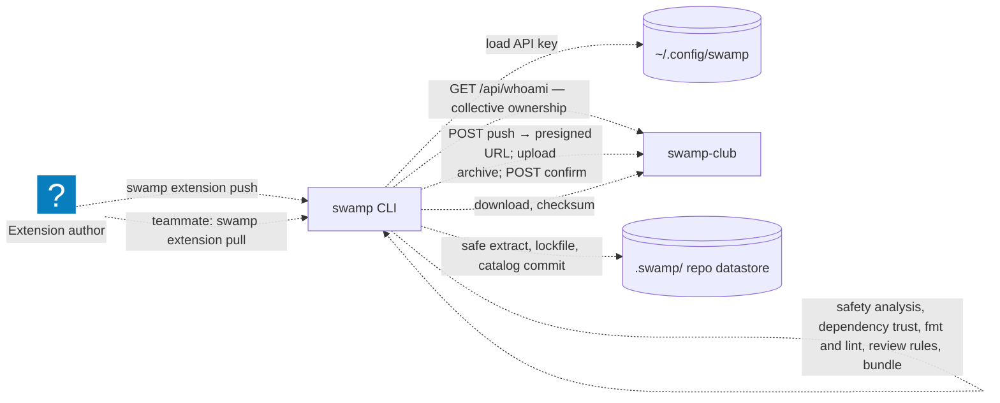

# Architecture

Swamp is an AI-native automation tool. An agent (or a person) describes an
external system as a **model**, runs its methods to produce versioned **data**,
wires methods into **workflows**, keeps credentials in **vaults**, packages
model types as **extensions**, and — when a team needs to share all of that —
runs a long-lived **serve** instance that others execute through. Those six
are the primitives; every other subsystem in the codebase exists to make one of
them work. See [README.md](./README.md) for the rule and the index.

The diagrams below are generated from the C4 model in
[architecture/](./architecture/) (`model.c4`, `views.c4`) with
`deno task diagrams:render`; CI runs `deno task diagrams:check` and fails when
they drift from the model. Journey diagrams link to the swamp-uat test that
proves the journey.

## Who uses swamp

The people are the personas swamp-uat tests against, and each arrow is the
command they type.

<!-- diagram: context -->

<!-- /diagram -->

Things swamp deliberately does **not** do, worth stating because a new reader
usually assumes otherwise: it runs no MCP server, it never calls an LLM API, and
it has no CI-platform awareness. Swamp is driven _by_ agents; it does not host
one.

## Containers — one binary, four runtime roles

`swamp` compiles to a single Deno binary (`scripts/compile.ts`, which also
embeds a second Deno runtime for bundling extensions, the bundled skills, and
the dashboard build). Which role a process plays is decided by its subcommand.

```mermaid
graph TB
  Builder@{ icon: "fa:user", shape: rounded, label: "Builder" }
  Author@{ icon: "fa:user", shape: rounded, label: "Extension author" }
  Operator@{ icon: "fa:user", shape: rounded, label: "Platform operator" }
  Member@{ icon: "fa:user", shape: rounded, label: "Team member" }
  Integrator@{ icon: "fa:user", shape: rounded, label: "Integrator system" }
  Osd@{ shape: rectangle, label: "OS service manager" }
  subgraph Swamp["`swamp`"]
    Swamp.Cli@{ shape: rectangle, label: "swamp CLI" }
    Swamp.Worker@{ shape: rectangle, label: "swamp worker connect" }
    Swamp.Userconfig@{ shape: disk, label: "~/.config/swamp" }
    Swamp.Runner@{ shape: rectangle, label: "dispatch runner" }
    Swamp.Serve@{ shape: rectangle, label: "swamp serve" }
    Swamp.Dashboard@{ shape: rectangle, label: "Dashboard SPA" }
    Swamp.Repo@{ shape: disk, label: ".swamp/ repo datastore" }
    Swamp.Control@{ shape: disk, label: "control-plane store" }
  end
  Wrapped@{ shape: rectangle, label: "Systems wrapped by models" }
  Club@{ shape: rectangle, label: "swamp-club" }
  Backends@{ shape: rectangle, label: "Extension-provided backends" }
  Otel@{ shape: rectangle, label: "OpenTelemetry collector" }
  Builder -. "`prompts the agent; the agent runs swamp`" .-> Swamp.Cli
  Author -. "`auth login, extension push and pull`" .-> Swamp.Cli
  Operator -. "`serve, access token mint, grants, worker 
token create`" .-> Swamp.Serve
  Operator -. "`worker connect on each machine`" .-> Swamp.Worker
  Member -. "`auth server-login, --server commands`" .-> Swamp.Cli
  Member -. "`browser`" .-> Swamp.Dashboard
  Integrator -. "`HMAC-signed webhook POST`" .-> Swamp.Serve
  Osd -. "`spawns and restarts`" .-> Swamp.Serve
  Osd -. "`spawns and restarts`" .-> Swamp.Worker
  Swamp.Cli -. "`runs commands with --server`" .-> Swamp.Serve
  Swamp.Cli -. "`reads and writes`" .-> Swamp.Repo
  Swamp.Cli -. "`stores credentials, spools telemetry`" .-> Swamp.Userconfig
  Swamp.Serve -. "`serves`" .-> Swamp.Dashboard
  Swamp.Serve -. "`reads and writes`" .-> Swamp.Repo
  Swamp.Serve -. "`heartbeats, leases, dedup`" .-> Swamp.Control
  Swamp.Worker -. "`enrol, receive dispatches, capability 
verbs`" .-> Swamp.Serve
  Swamp.Runner -. "`reads and writes data, fetches bundles`" .-> Swamp.Serve
  Swamp.Dashboard -. "`commands and health stream`" .-> Swamp.Serve
  Swamp.Worker -. "`spawns one per dispatch`" .-> Swamp.Runner
  Swamp.Cli -. "`login, whoami, extension push and pull, 
issues, update check`" .-> Club
  Swamp.Cli -. "`executes model methods`" .-> Wrapped
  Swamp.Cli -. "`in-process datastore and vault providers`" .-> Backends
  Swamp.Cli -. "`traces and logs, opt-in`" .-> Otel
  Swamp.Serve -. "`instance heartbeat, collective refresh, 
OAuth device grant`" .-> Club
  Swamp.Serve -. "`in-process datastore and vault 
providers; shared control plane`" .-> Backends
  Swamp.Serve -. "`traces and logs, opt-in`" .-> Otel
  Swamp.Runner -. "`executes placed model methods`" .-> Wrapped
```

<!-- diagram: containers -->

<!-- /diagram -->

| Container                | Runs as                                                 | Owns                                                                                                     |
| ------------------------ | ------------------------------------------------------- | -------------------------------------------------------------------------------------------------------- |
| **swamp CLI**            | `swamp <command>` — every user and agent interaction    | Nothing durable; writes the repo datastore and `~/.config/swamp`                                         |
| **swamp serve**          | `swamp serve` — one `Deno.serve` listener on one port   | Per-instance registries in memory; the shared repo datastore, control-plane keys, `.swamp/serve.yaml`    |
| **swamp worker connect** | `swamp worker connect` — outbound only, no repo         | A machine id and a content-addressed bundle cache                                                        |
| **dispatch runner**      | `swamp worker exec-dispatch` — one child per dispatch   | A scratch directory; talks to serve over the HTTP data plane                                             |
| **Dashboard SPA**        | React app served at `/dashboard/*`                      | Browser-local state only                                                                                 |

Two facts a new engineer otherwise learns the hard way:

- **Serve instances never talk to each other.** High availability is entirely
  a matter of several instances reading and writing the same control-plane
  keys (heartbeats, active runs, pending runs, cron dedup) in the shared
  datastore. There is no gossip and no leader. See
  [primitives/serve.md](./primitives/serve.md).
- **Cron scheduling runs inside serve**, not in the OS daemons. launchd,
  systemd and cron units only keep the `serve` and `worker` processes alive
  and run autoupdate.

The CLI and serve are two adapters over the same application layer:
`src/libswamp` holds one async-generator use case per verb, and both
`src/cli/commands` and `src/serve/handlers` consume those streams. That is why
106 commands work identically with `--server`.

<!-- diagram: cliComponents -->

<!-- /diagram -->

The dependency rule between those layers (`cli → libswamp → domain ←
infrastructure`, never the reverse) is enforced by
`integration/ddd_layer_rules_test.ts` and `integration/architecture_boundary_test.ts`,
including a pinned list of existing violations that may shrink but never grow.
[contributing/libswamp.md](../contributing/libswamp.md) explains the pattern.

## Where things live

A swamp repo is a git repository with a `.swamp.yaml` marker
([surfaces/repo.md](./surfaces/repo.md)). It separates source of truth from
runtime data:

- **Source of truth, tracked in git** — `models/{type}/{name}.yaml`,
  `workflows/workflow-{name}.yaml`, `vaults/{type}/{id}.yaml`, `grants/`.
  These are what an agent edits and a reviewer reads.
- **Runtime data, in the datastore** — the `.swamp/` directory by default, or a
  filesystem path or S3 through a datastore extension
  ([enablers/datastores.md](./enablers/datastores.md)): versioned data and its
  SQLite catalog, method outputs, workflow runs, `run_tracker.db`, the local
  vault, the extension catalog, pulled extensions, the audit log.
- **Per user** — `~/.config/swamp/` for swamp-club and serve credentials, the
  anonymous identity and the telemetry spool; `~/.swamp/` for the binary and
  the embedded Deno runtime.

Extensions are per repo, under `.swamp/pulled-extensions/`, never global.

## Journeys

Each diagram is one thing one person does, end to end, and names the swamp-uat
test that exercises it against the real binary.

### Builder: run my model and see the data

<!-- diagram: journeyLocalRun -->

<!-- /diagram -->

The only child process on the local path is `deno bundle` for an extension
that is not yet cached; method bodies run in-process. Vault values reach the
method as sentinels resolved at the last moment and are redacted from every
persisted log. Proven by `tests/cli/tutorial/hello_world_test.ts`, which drives
Claude Code for real.

### Builder: run a workflow that waits for my approval

<!-- diagram: journeyApproval -->

<!-- /diagram -->

A `manual_approval` step suspends the run at a level boundary; the run is
persisted, `workflow approve` records the decision, and resume skips steps that
already reached a terminal state. Proven by
`tests/cli/e2e/workflow_manual_approval_test.ts`.

### Team member: run it on the server

<!-- diagram: journeyRemoteRun -->

<!-- /diagram -->

Token verification, rate limiting and grant evaluation happen before the
handler reaches the same libswamp use case the CLI would run locally. A run
survives the client disconnecting: events are buffered by sequence number and a
reconnecting CLI resumes with `run.attach(afterSeq)`; if the run lives on
another instance the server answers `run.elsewhere` and the CLI retries.
Proven by `tests/cli/serve/none/operations_test.ts` and
`tests/cli/serve/access/enforcement_test.ts`.

### Fleet operator: this step must run on a labelled machine

<!-- diagram: journeyPlacedStep -->

<!-- /diagram -->

Placement (`target`, `labels`, `platform`) on a workflow, job or step selects
an eligible worker; the orchestrator takes a lease, pushes the dispatch over
the worker's own WebSocket, and the worker isolates the extension code in a
child runner that reads and writes data through the HTTP data plane. Worker
fleet state is ordinary swamp data. Proven by
`tests/cli/worker/dispatch/placement_test.ts` and `lifecycle_test.ts`. Detail:
[enablers/remote-execution.md](./enablers/remote-execution.md).

### Extension author: publish to my collective

<!-- diagram: journeyPublish -->

<!-- /diagram -->

Push is a sequence of gates — credentials, collective ownership from
`GET /api/whoami`, safety analysis, dependency trust, `deno fmt` and `lint`,
review rules — before the archive is uploaded to a presigned URL and confirmed.
Pull verifies the checksum, extracts safely, records the lockfile and commits
to the extension catalog in one transaction. Proven by
`tests/club/flows/extensions.spec.ts` and
`tests/cli/e2e/extension_workflow_test.ts`. Detail:
[primitives/extensions.md](./primitives/extensions.md).

## Not drawn on purpose

High availability has no user-visible sequence — a second instance simply
reads the same control-plane keys — so it is a section in
[primitives/serve.md](./primitives/serve.md) rather than a journey, with
`tests/cli/serve/oauth/cluster_basics_test.ts` as its proof. Code-level
diagrams are not maintained; an IDE produces them on demand.
